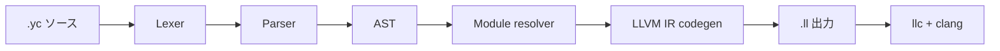
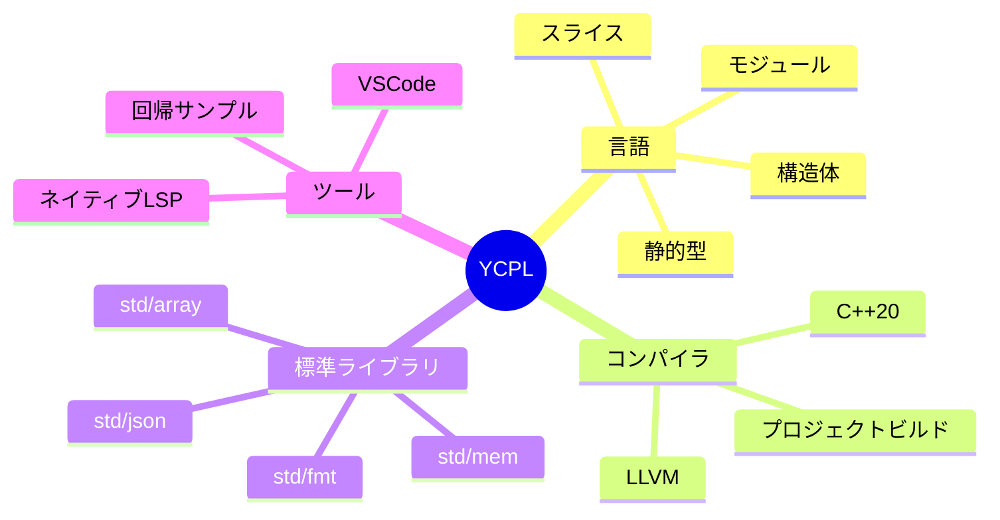
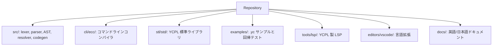
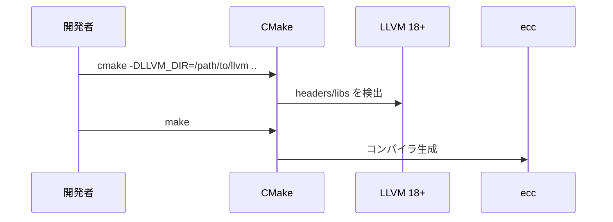
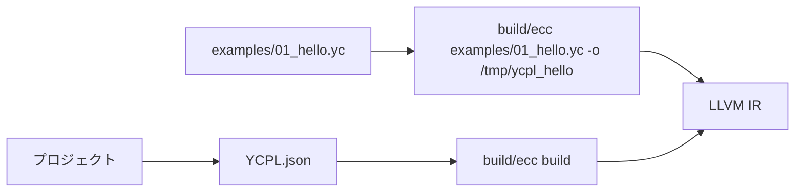
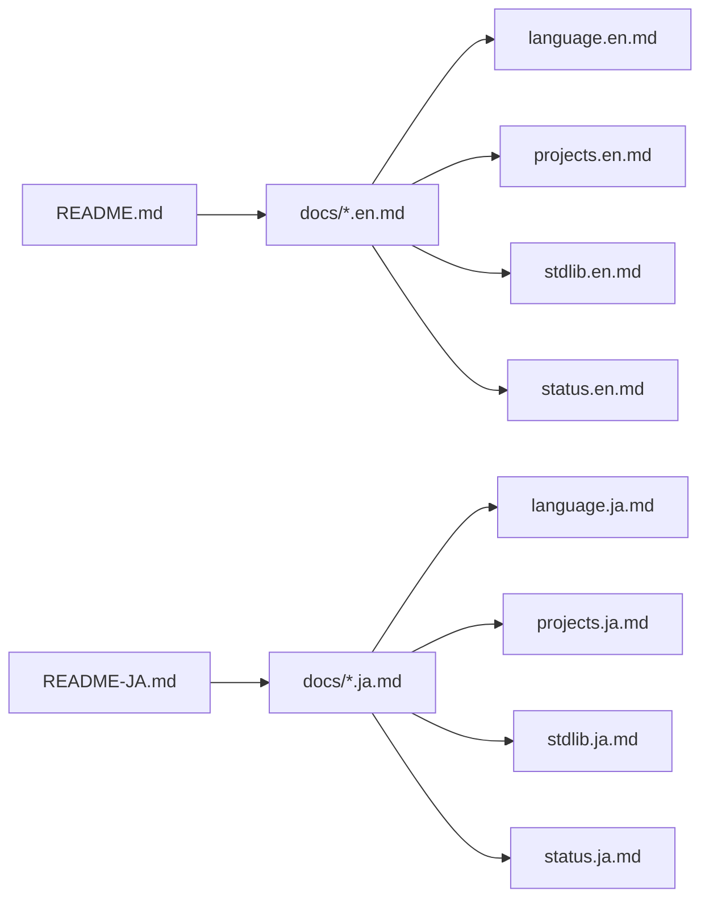
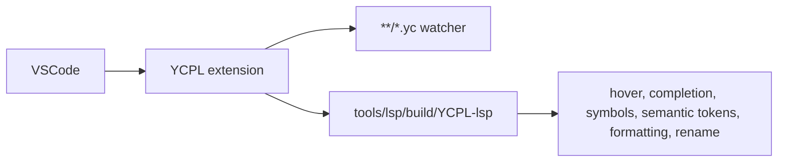
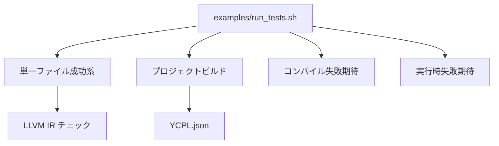

# YCPL

[English](README.md) | [English docs](docs/README.en.md) | [日本語 docs](docs/README.ja.md)

YCPL は、システムプログラミング向けの実験的な言語です。C++ 製コンパイラ、
LLVM バックエンド、YCPL で書かれた標準ライブラリ、サンプル、LSP を含みます。
ソース拡張子は `.yc` です。





## 全体像



| 項目 | 状態 |
|---|---|
| 安定性 | かなり初期の alpha、production 非推奨 |
| ソース拡張子 | `.yc` |
| ビルド出力 | LLVM IR (`.ll`) |
| プロジェクト設定 | `YCPL.json` |
| 主なエディタ導線 | VSCode Remote Dev Containers |

## ビルド



```sh
mkdir build
cd build
cmake -DLLVM_DIR=/your/llvm/path/cmake ..
make
```

## コンパイル



```sh
build/ecc examples/01_hello.yc -o /tmp/ycpl_hello
cd examples/04_module_project && ../../build/ecc build
```

## 言語スナップショット

```mermaid
flowchart TD
    Module["module math"] --> Public["pub fn add(...)"]
    Import["import \"math\" as math"] --> Call["math.add(1, 2)"]
    Types["i32, i64, bool, string, *T, []T"] --> Values["変数、リテラル、構造体"]
    Flow["if / for / break / continue"] --> Main["fn main()"]
```

```YCPL
import "std/fmt" as fmt

fn main() {
    fmt.println("Hello World")
}
```

## ドキュメント



- [言語構文](docs/language.ja.md)
- [プロジェクトとモジュール](docs/projects.ja.md)
- [標準ライブラリ](docs/stdlib.ja.md)
- [実装状況](docs/status.ja.md)
- [YCPL LSP](tools/lsp/README.md)

## エディタと LSP



```sh
npm ci --prefix editors/vscode
tools/lsp/build.sh
tools/lsp/run_tests.sh
```

## テスト



```sh
examples/run_tests.sh
```
