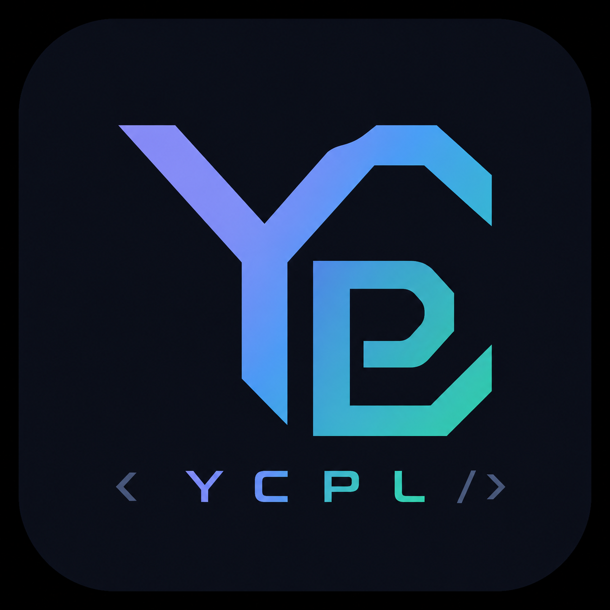

<p align="center">
  
</p>

<h1 align="center">YCPL</h1>

<p align="center">
  <a href="README-JA.md">日本語</a> |
  <a href="docs/README.en.md">English docs</a> |
  <a href="docs/README.ja.md">日本語 docs</a>
</p>

YCPL is an experimental systems-programming language with a self-hosted
compiler, LLVM 22 backend, statically linked managed runtime, bundled standard
library, examples, and a YCPL-written LSP. Source files use the `.yc` extension.

```text
.yc source -> lexer -> canonical AST -> resolver/type checker -> LLVM C API
                                                               |
                                                               v
                                                        LLVM IR (.ll)
                                                               |
                                                               v
                                                          llc + clang
                                                               |
                                                               v
                                                 native binary + runtime
```

## Repository

```text
bootstrap/cpp/          C++ seed and reference compiler
compiler/ycpl/          self-hosted YCPL compiler
bootstrap/cpp/runtime/  external managed-allocation runtime
stl/c/                  C and LLVM API declarations
stl/std/                YCPL standard library
examples/               language, stdlib, and project examples
tests/                  conformance, negative, project, and runtime fixtures
tools/lsp/              LSP written in YCPL
editors/vscode/         VS Code extension and portable TypeScript LSP
```

YCPL is early alpha and not production-ready. The compiler accepts single
files and `YCPL.json` projects, produces LLVM IR with `build-ir`, native
binaries with `build`, and builds then executes with `run`.

## Build

LLVM 22, `llc`, and `clang` remain external prerequisites.

```sh
eval "$(scripts/setup-llvm.sh 22 --print-env)"
bazel build //:ycc //:ycc-bootstrap //:ycc-ycpl
bazel test //...
```

The Bazel compiler chain is:

```text
ycc-bootstrap (C++ seed)
    -> ycc-stage1
    -> ycc-stage2
    -> ycc-stage3
    -> ycc
       └─ ycc-ycpl (compatibility alias)
```

Only stage1 is generated by the C++ seed. Stage2 is generated by stage1 and
stage3 by stage2. The standard `ycc` is stage3; its normal command path has no
route back to the C++ executable. `build-ir-self` remains a deprecated alias of
`build-ir`.

`scripts/setup-llvm.sh` reports `LLVM_CONFIG`, `LLVM_BINDIR`, `LLVM_DIR`, and a
PATH prefix without creating system symlinks. CMake remains available for the
C++ seed/reference implementation:

```sh
cmake -S . -B build
cmake --build build
```

## Compile

```sh
bazel run //:ycc -- build examples/basics/hello.yc -o /tmp/ycpl-hello
bazel run //:ycc -- run examples/basics/hello.yc -o /tmp/ycpl-hello
bazel run //:ycc -- build-ir examples/basics/hello.yc -o /tmp/ycpl-ir

cd examples/projects/module_project
../../../bazel-bin/ycc build
```

Supported driver commands are `build`, `build-ir`, `run`, `debug`, `lex`,
`parse`, `check`, `resolve`, and `help`, with `-o`, `--keep-obj`,
`--link-llvm`, and `--` program arguments.

The runtime is resolved in this order:

1. `YCPL_RUNTIME_LIB`
2. `libyc_runtime.a` adjacent to the compiler executable
3. the development runtime selected by `YCPL_RUNTIME_SRC`

The standard-library source root may be selected with `YCPL_STL_ROOT`; Bazel
runfiles and development-tree invocations provide it automatically.

## Self Hosting

`ProgramAst` and `AstArena` are the compiler's only front end representation.
Files receive stable file IDs and cross-file references use resolved file/node
and symbol IDs. Dynamic arenas replace the former fixed limits on locals,
functions, arguments, and struct fields.

The backend declares named types, functions, and externs before lowering
function bodies. It lowers resolved expressions and statements directly via
the LLVM C API, including structs, enums, aliases, pointers, slices, arrays,
maps, calls, UFCS, short-circuit operators, bounds checks, loops, switch,
defer/scope unwind, casts, variadics, and managed ownership transitions.
LLVM module verification is mandatory.

Source discovery follows symlinks using `stat`, tracks visited device/inode
pairs to prevent cycles, recursively scans configured `src` roots, and sorts
project-relative paths before assigning file IDs.

The fixed-point test rebuilds the compiler with stage2 and stage3, passes both
IR files through LLVM 22 `llvm-as` and `llvm-dis`, normalizes only module/source
path metadata, and requires byte-for-byte equality. Target triple, data layout,
symbols, and instructions are not ignored.

## Language Snapshot

The conformance surface includes primitive types, pointers, slices, arrays,
structs, enums, aliases, `Vec<T>`, `Map`, `none`, `owned`, functions,
extern/intrinsic and variadic calls, modules/import aliases/public visibility,
`if`, `switch`, `for`, `for-in`, `break`, `continue`, `defer`, `scope`, and
UFCS calls.

`Vec<T>` is a compiler-built-in managed dynamic array. Construct it with
`Vec<T>{}` or `Vec<T>{capacity: n}` and use `push`, `len`, `capacity`,
`reserve`, `clear`, indexed reads/writes, and `as_slice`. Copies share the same
handle, while `[]T` is a non-growing view. The public API exposes neither a raw
data pointer nor manual `free`.

`none` is a null literal rather than an optional type. Managed allocations use
deterministic function/scope frames; returned roots move to the caller and
array/Vec/map/text/bytes/json ownership graphs release their children together.

## C and LLVM APIs

The canonical location for external C API declarations is `stl/c/*`. The
compiler uses `c/llvm` for LLVM 22 and `c/stdlib`/`c/yc_runtime` for its narrow
C/runtime boundary. Except for existing compatibility wrappers, `stl/std/*`
contains language-level APIs.

## Tests

```sh
# Apply the same conformance oracle to any compiler executable.
tests/run_conformance.sh ./bazel-bin/ycc

# Fixed point, examples, runtime, LSP, and all Bazel targets.
bazel test //:self_host_stage_test //:ycc_ycpl_test
bazel test //...
```

The conformance suite covers all examples, stdlib and `c/*` FFI, project/module
builds, runtime ownership, and negative exit/location/message checks. The Bazel
fixed-point test also removes seed/fallback variables and the bootstrap binary
from the stage2/stage3 execution environment.

## VS Code

The VS Code extension prefers a configured or workspace-built `YCPL-lsp`, then
`YCPL-lsp` on `PATH`, and falls back to the TypeScript server bundled in its
VSIX. It discovers the self-hosted `ycc` and provides check, build, build-ir,
and run commands with editor diagnostics.

```sh
npm ci --prefix editors/vscode/language-server
npm run check --prefix editors/vscode/language-server
npm ci --prefix editors/vscode/extension
npm run check --prefix editors/vscode/extension
npm run package --prefix editors/vscode/extension
```

See [the VS Code extension guide](editors/vscode/extension/README.md).

## Documentation

- [Language reference](docs/language.en.md)
- [Vec and memory ownership](docs/memory.en.md)
- [Self-hosting verification](docs/self-hosting.en.md)
- [Grammar](docs/grammar/ycpl.ebnf)
- [Standard library](docs/stdlib.en.md)
- [Current Japanese status](docs/status.ja.md)
- [Examples](examples/README.md)
- [Tests](tests/README.md)
