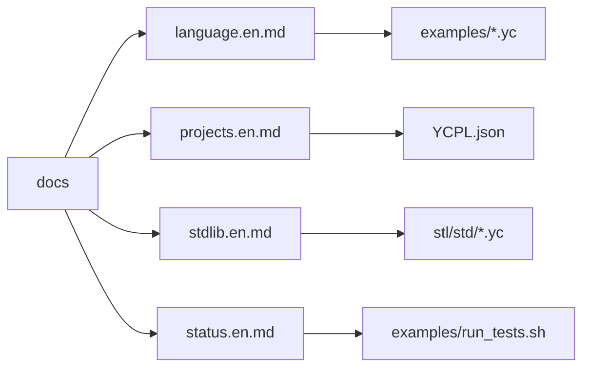
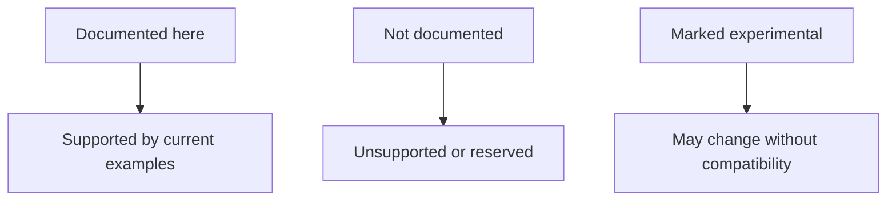

# YCPL Documentation

[Japanese](README.ja.md) | [Repository README](../README.md)

These docs describe the syntax and toolchain supported by the current compiler.
YCPL source files use `.yc`.

| Start Here | Covers |
|---|---|
| [Language Syntax](language.en.md) | Syntax, types, statements, expressions |
| [Projects and Modules](projects.en.md) | `YCPL.json`, imports, module visibility |
| [Standard Library](stdlib.en.md) | `std/*` source modules and intrinsic bridges |
| [Implementation Status](status.en.md) | Stable, experimental, and reserved features |
| [YCPL LSP](../tools/lsp/README.md) | Editor protocol support |

