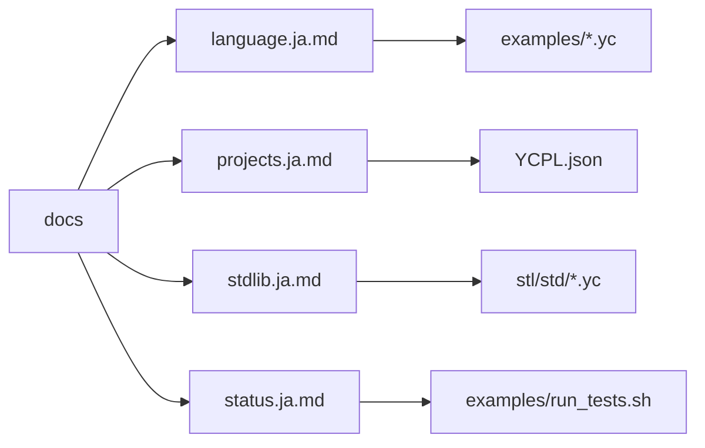
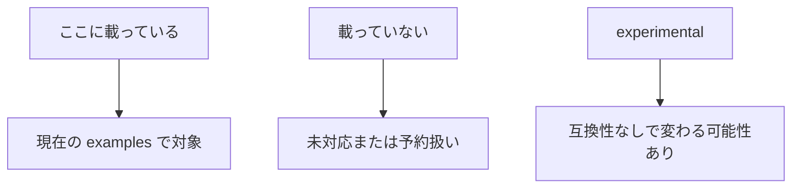

# YCPL ドキュメント

[English](README.en.md) | [Repository README](../README-JA.md)

この docs は、現在のコンパイラが意図して対応している構文とツールチェーンを
まとめています。YCPL ソースの拡張子は `.yc` です。

| 入口 | 内容 |
|---|---|
| [言語構文](language.ja.md) | 構文、型、文、式 |
| [プロジェクトとモジュール](projects.ja.md) | `YCPL.json`、import、公開範囲 |
| [標準ライブラリ](stdlib.ja.md) | `std/*` ソースモジュールと intrinsic bridge |
| [実装状況](status.ja.md) | 安定、実験中、予約済み機能 |
| [YCPL LSP](../tools/lsp/README.md) | エディタプロトコル対応 |

