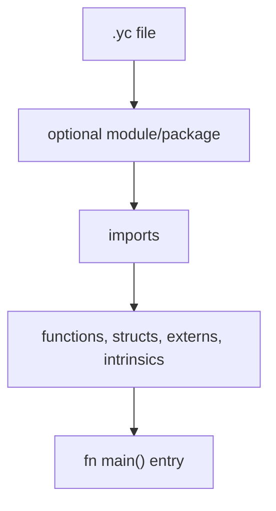
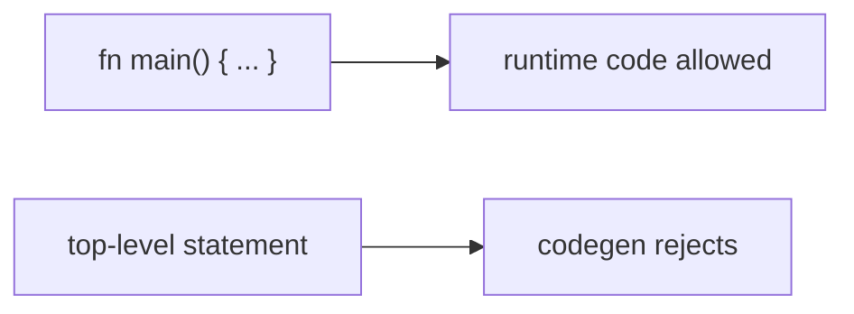
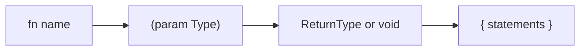
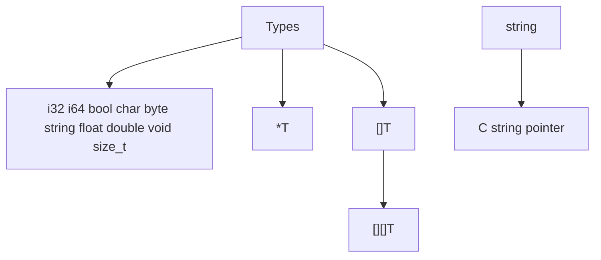
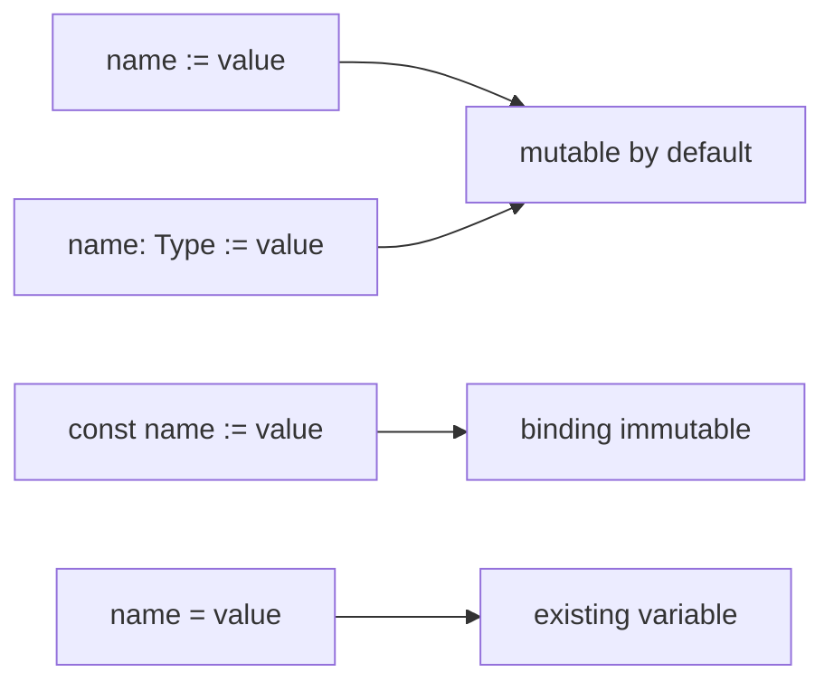
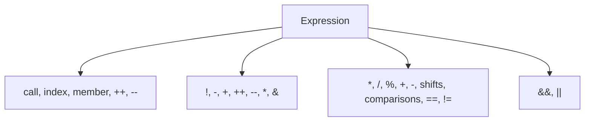

# YCPL Language Syntax

[Japanese](language.ja.md) | [Docs index](README.en.md)



## Source Files

| Rule | Current support |
|---|---|
| Extension | `.yc` |
| Statement separator | newline |
| Comments | `// line`, nested `/* block */` |
| Top-level runtime code | rejected by codegen |



## Identifiers And Keywords

Identifiers start with a letter or `_`, followed by letters, digits, or `_`.

```text
module package import pub extern intrinsic fn struct enum interface const mut
if else match for in return break continue as is go defer select switch
true false none or type importas byte
```

## Modules And Imports

```mermaid
flowchart LR
    Import["import \"math/basic\" as math"] --> Alias["math"]
    Alias --> Call["math.square(5)"]
    Module["module math.basic"] --> Export["pub fn square"]
    Export --> Call
```

```YCPL
module math.basic

pub fn square(x i32) i32 {
    return x * x
}
```

```YCPL
import "math/basic" as math

fn main() {
    result := math.square(5)
}
```

Rules: imported functions must be called through their alias; same-module
functions may be called directly; `pub fn` and `pub struct` are exported.

## Functions



```YCPL
pub fn add(a i32, b i32) i32 {
    return a + b
}

extern fn c_strlen(s string) i64 as "strlen"
```

`intrinsic fn` is accepted only inside bundled `std` modules.

## Types



Runtime slices use `{ data, len, cap, elem_size }` and are manually managed
when created by `std/array`.

## Variables And Literals



```YCPL
count := 10
name: string := "YCPL"
const label: string := "stable"
```

Supported literals include integers, floats, chars, strings, raw strings,
booleans, `none`, arrays, and byte arrays.

## Operators And Control Flow



```YCPL
if score >= 80 {
    println("pass")
} else {
    println("retry")
}

for i := 0; i < 10; i++ {
    println(i)
}

for value in xs {
    println(value)
}
```
