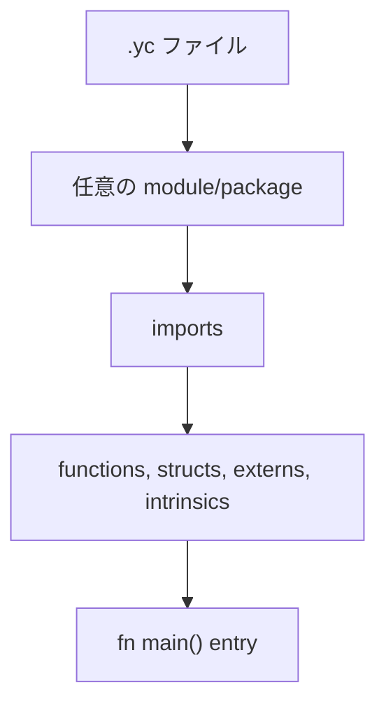
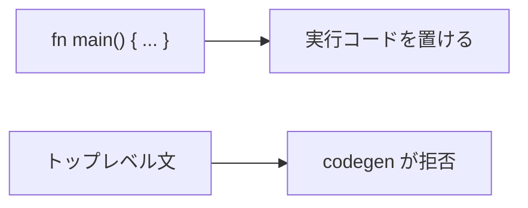
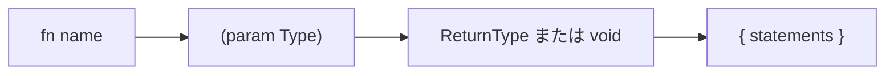
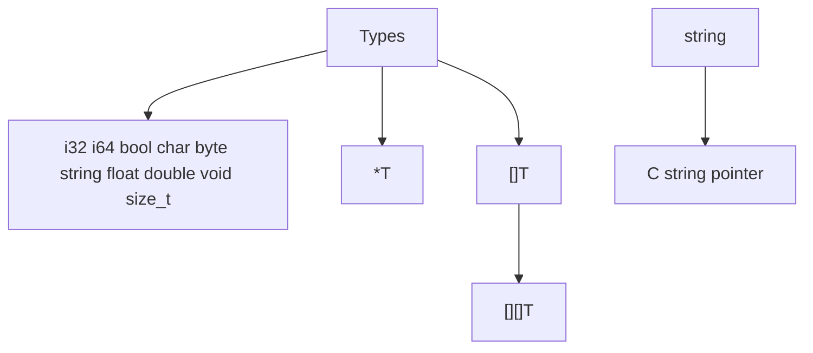
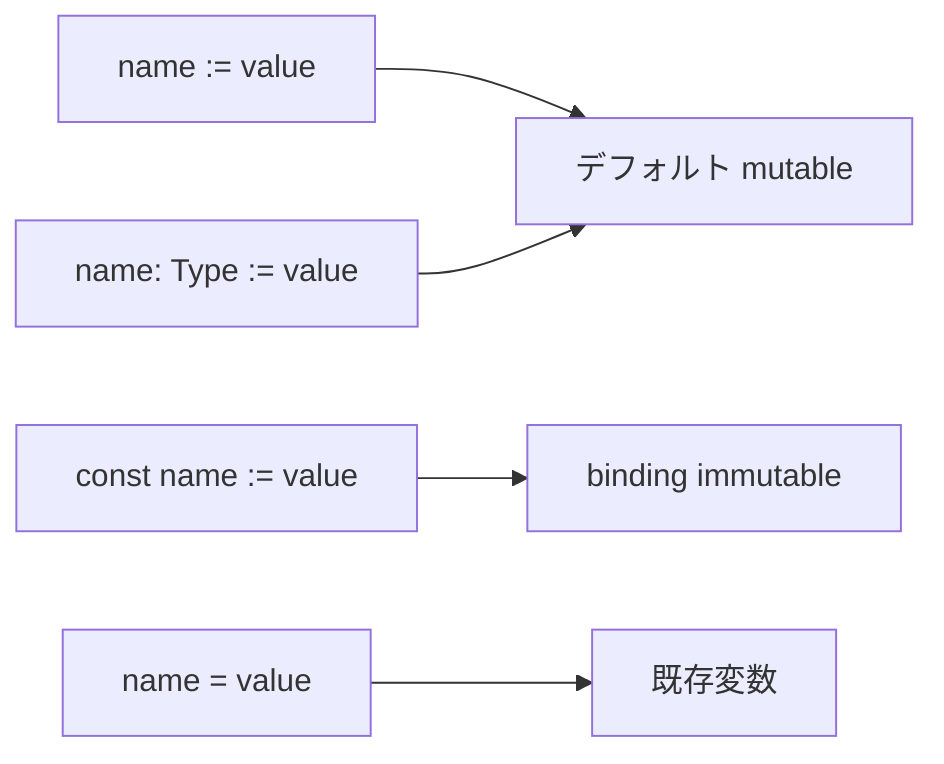
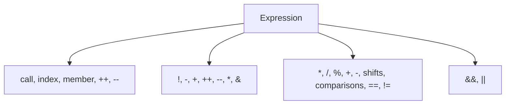

# YCPL 言語構文

[English](language.en.md) | [Docs index](README.ja.md)



## ソースファイル

| ルール | 現在の対応 |
|---|---|
| 拡張子 | `.yc` |
| 文の区切り | 改行 |
| コメント | `// line`、ネスト可能な `/* block */` |
| トップレベル実行文 | codegen で拒否 |



## 識別子とキーワード

識別子は英字または `_` で始まり、英字、数字、`_` を続けられます。

```text
module package import pub extern intrinsic fn struct enum interface const mut
if else match for in return break continue as is go defer select switch
true false none or type importas byte
```

## モジュールと import

```mermaid
flowchart LR
    Import["import \"math/basic\" as math"] --> Alias["math"]
    Alias --> Call["math.square(5)"]
    Module["module math.basic"] --> Export["pub fn square"]
    Export --> Call
```

```YCPL
module math.basic

pub fn square(x i32) i32 {
    return x * x
}
```

```YCPL
import "math/basic" as math

fn main() {
    result := math.square(5)
}
```

import した関数は alias 経由で呼びます。同じモジュール内の関数は直接呼べます。
`pub fn` と `pub struct` は外部モジュールから見えます。

## 関数



```YCPL
pub fn add(a i32, b i32) i32 {
    return a + b
}

extern fn c_strlen(s string) i64 as "strlen"
```

`intrinsic fn` は bundled `std` モジュール内だけで受け付けます。

## 型



runtime slice は `{ data, len, cap, elem_size }` です。`std/array` で作った
slice は手動で管理します。

## 変数とリテラル



```YCPL
count := 10
name: string := "YCPL"
const label: string := "stable"
```

整数、浮動小数、char、string、raw string、bool、`none`、array、byte array を
リテラルとして扱えます。

## 演算子と制御構文



```YCPL
if score >= 80 {
    println("pass")
} else {
    println("retry")
}

for i := 0; i < 10; i++ {
    println(i)
}

for value in xs {
    println(value)
}
```
