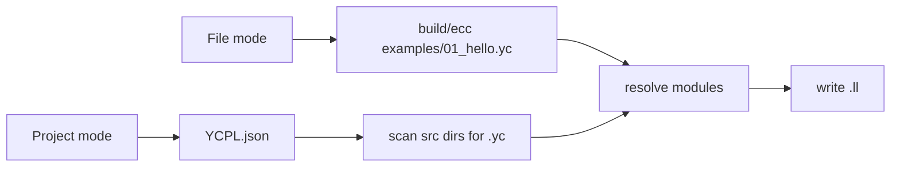
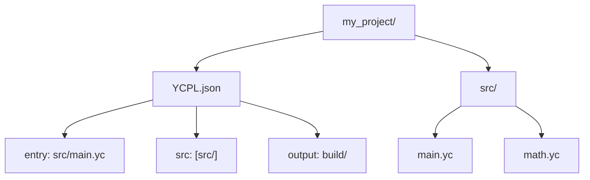
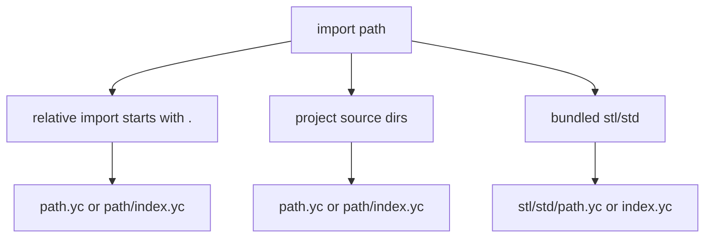
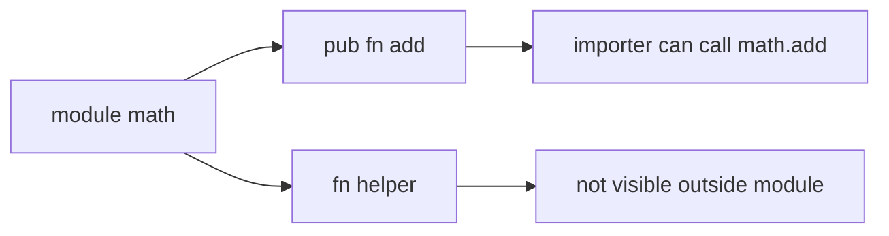

# Projects And Modules

[Japanese](projects.ja.md) | [Docs index](README.en.md)

YCPL compiles either explicit `.yc` files or a project rooted by `YCPL.json`.



## Single File

```sh
build/ecc examples/01_hello.yc -o /tmp/ycpl_hello
```

## Project Layout



```json
{
  "name": "my_project",
  "version": "0.1.0",
  "entry": "src/main.yc",
  "src": ["src/"],
  "output": "build/"
}
```

| Field | Meaning |
|---|---|
| `name` | Project name |
| `version` | Project version string |
| `entry` | Intended entry source |
| `src` | Source directories scanned recursively for `.yc` |
| `output` | Directory for generated LLVM IR |

```sh
build/ecc build
```

## Import Resolution



## Visibility



```YCPL
module math

pub fn add(a i32, b i32) i32 {
    return a + b
}
```

```YCPL
import "math" as math

fn main() {
    result := math.add(1, 2)
}
```

Imported functions must be called as `alias.symbol(...)`. Public function LLVM
symbols are mangled as `module__name`; `main` stays `main`.
