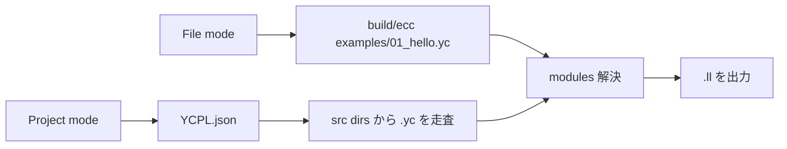
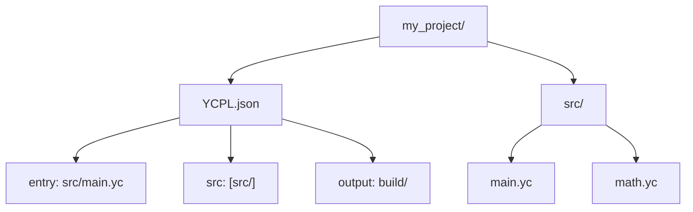
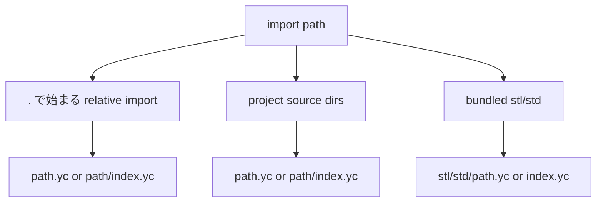
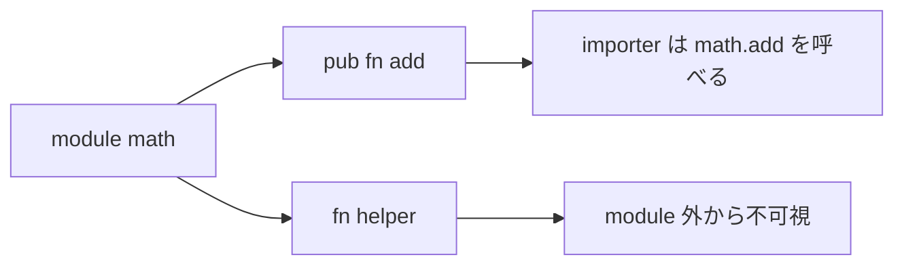

# プロジェクトとモジュール

[English](projects.en.md) | [Docs index](README.ja.md)

YCPL は明示した `.yc` ファイル、または `YCPL.json` を持つプロジェクトを
コンパイルできます。



## 単一ファイル

```sh
build/ecc examples/01_hello.yc -o /tmp/ycpl_hello
```

## プロジェクト構成



```json
{
  "name": "my_project",
  "version": "0.1.0",
  "entry": "src/main.yc",
  "src": ["src/"],
  "output": "build/"
}
```

| フィールド | 意味 |
|---|---|
| `name` | プロジェクト名 |
| `version` | バージョン文字列 |
| `entry` | 想定エントリソース |
| `src` | 再帰的に `.yc` を探すソースディレクトリ |
| `output` | 生成 LLVM IR の出力先 |

```sh
build/ecc build
```

## import 解決



## 公開範囲



```YCPL
module math

pub fn add(a i32, b i32) i32 {
    return a + b
}
```

```YCPL
import "math" as math

fn main() {
    result := math.add(1, 2)
}
```

import した関数は `alias.symbol(...)` で呼びます。公開関数の LLVM symbol は
`module__name` に mangle され、`main` は `main` のままです。
