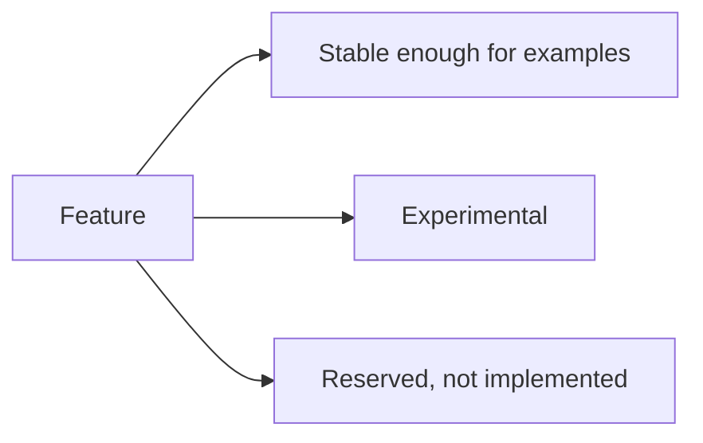
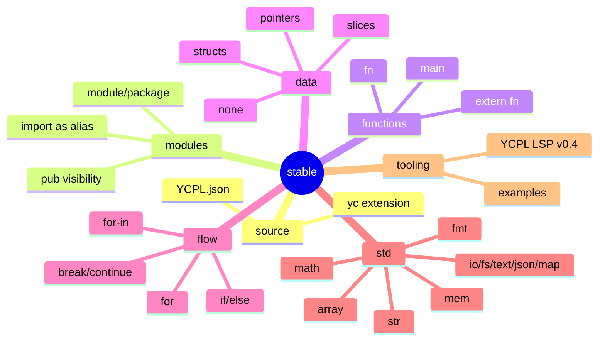
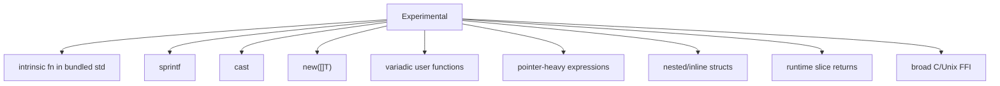
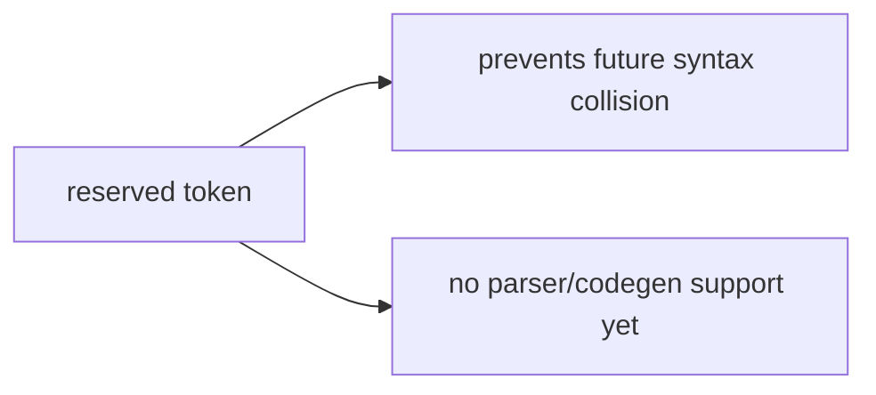

# Implementation Status

[Japanese](status.ja.md) | [Docs index](README.en.md)



## Stable Enough For Examples



## Experimental



## Reserved But Not Implemented

```text
enum interface match is go defer select switch or type importas
```



Notes: `none` is a null literal, not an optional type; imported direct calls are
rejected; LSP navigation currently scans open documents rather than a full
project index.
