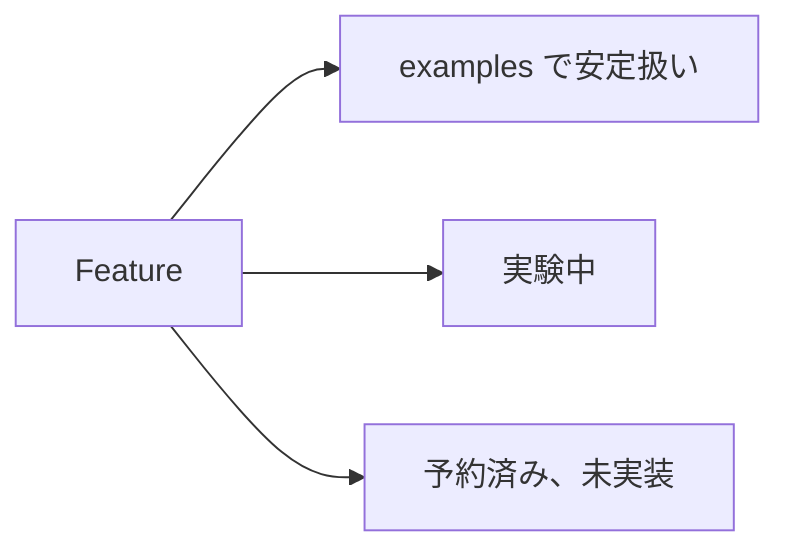
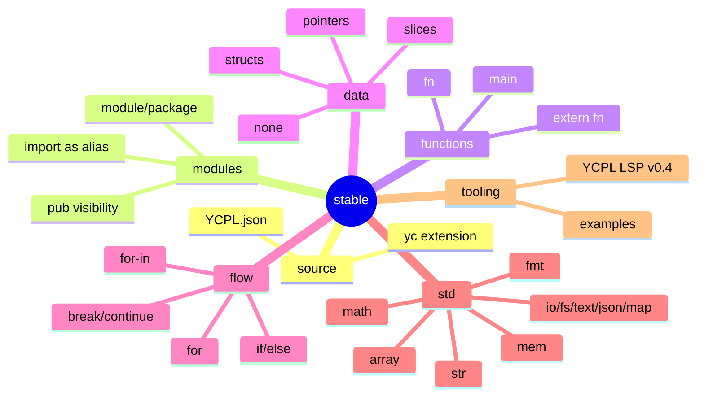
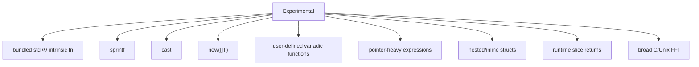
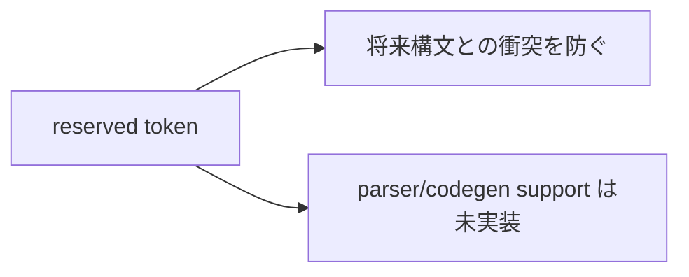

# 実装状況

[English](status.en.md) | [Docs index](README.ja.md)



## examples で安定扱い



## 実験中



## 予約済みだが未実装

```text
enum interface match is go defer select switch or type importas
```



`none` は optional type ではなく null literal です。import した関数の直接呼びは
拒否されます。LSP navigation は現在、full project index ではなく開いている
document を走査します。
