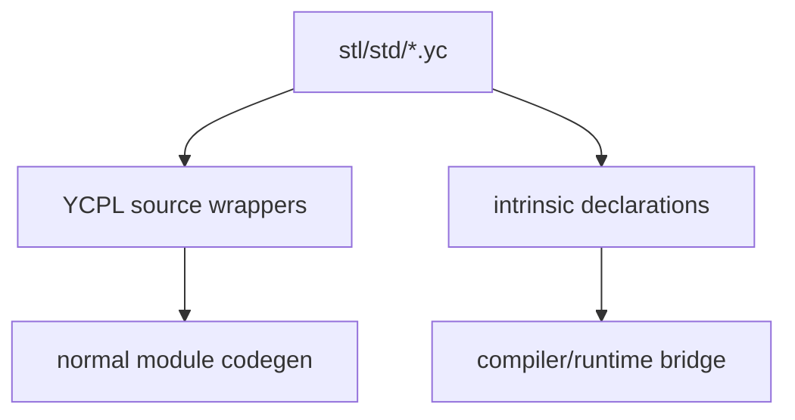
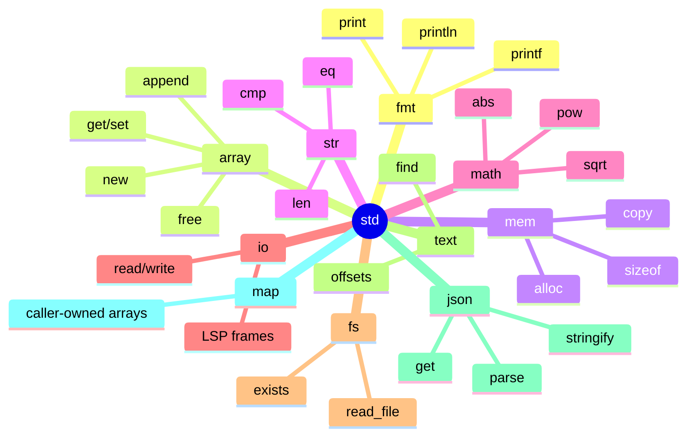
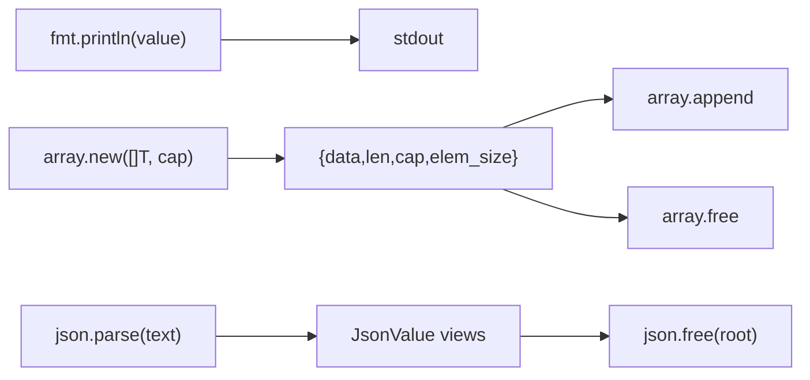
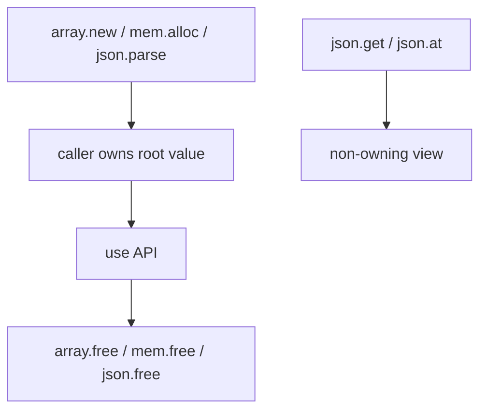

# YCPL Standard Library

[Japanese](stdlib.ja.md) | [Docs index](README.en.md)

The standard library is stored as YCPL source under `stl/std`. Some low-level
APIs are declared as `intrinsic fn` and implemented by compiler/runtime bridge
code.



## Module Map



| Module | Source |
|---|---|
| `std/fmt` | `stl/std/fmt.yc` |
| `std/array` | `stl/std/array.yc` |
| `std/mem` | `stl/std/mem.yc` |
| `std/str` | `stl/std/str.yc` |
| `std/math` | `stl/std/math.yc` |
| `std/io` | `stl/std/io.yc` |
| `std/fs` | `stl/std/fs.yc` |
| `std/text` | `stl/std/text.yc` |
| `std/json` | `stl/std/json.yc` |
| `std/map` | `stl/std/map.yc` |

## Common Flows



```YCPL
import "std/fmt" as fmt
import "std/array" as array

fn main() {
    xs := array.new([]i32, 1)
    xs = array.append(xs, 10)
    fmt.println(array.get(xs, 0))
    array.free(xs)
}
```

## Memory Ownership



`extern fn` maps YCPL names to C/LLVM symbols. `intrinsic fn` is reserved for
bundled `std` modules and is rejected in user modules.
