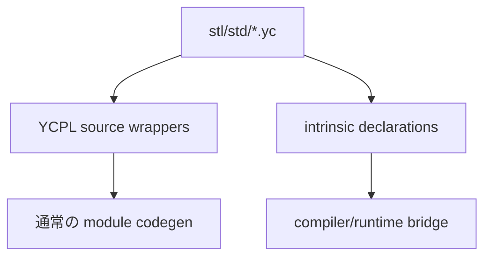
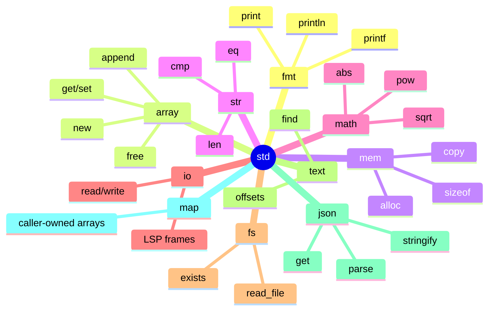
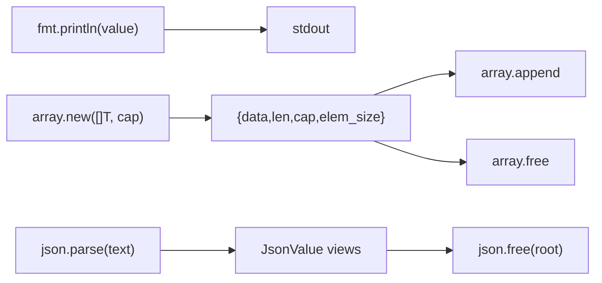
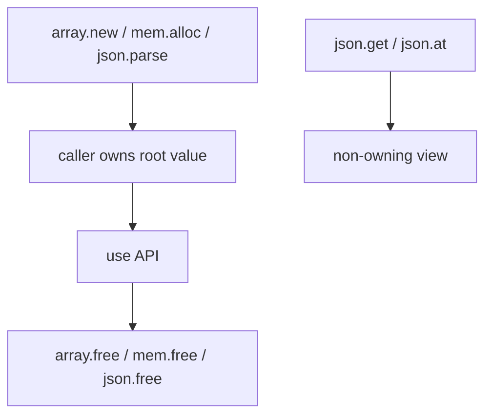

# YCPL 標準ライブラリ

[English](stdlib.en.md) | [Docs index](README.ja.md)

標準ライブラリは `stl/std` 配下の YCPL ソースです。一部の低レベル API は
`intrinsic fn` として宣言され、compiler/runtime bridge で実装されます。



## モジュール地図



| Module | Source |
|---|---|
| `std/fmt` | `stl/std/fmt.yc` |
| `std/array` | `stl/std/array.yc` |
| `std/mem` | `stl/std/mem.yc` |
| `std/str` | `stl/std/str.yc` |
| `std/math` | `stl/std/math.yc` |
| `std/io` | `stl/std/io.yc` |
| `std/fs` | `stl/std/fs.yc` |
| `std/text` | `stl/std/text.yc` |
| `std/json` | `stl/std/json.yc` |
| `std/map` | `stl/std/map.yc` |

## よく使う流れ



```YCPL
import "std/fmt" as fmt
import "std/array" as array

fn main() {
    xs := array.new([]i32, 1)
    xs = array.append(xs, 10)
    fmt.println(array.get(xs, 0))
    array.free(xs)
}
```

## メモリ所有



`extern fn` は YCPL 名を C/LLVM symbol に対応させます。`intrinsic fn` は bundled
`std` 専用で、user module では拒否されます。
